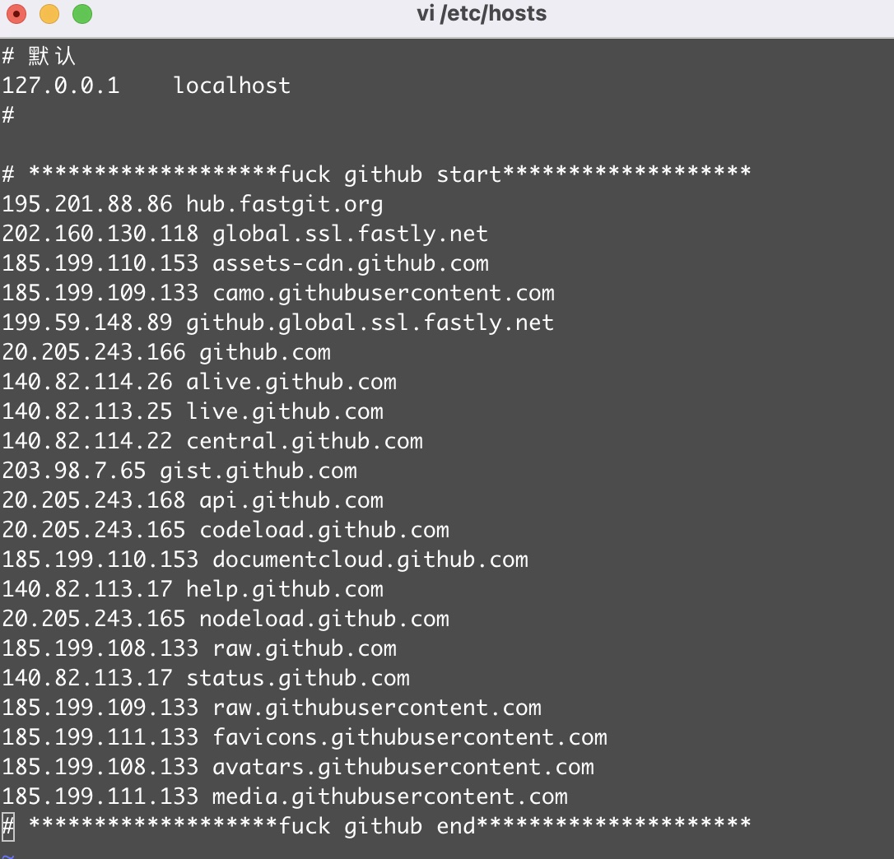

## 一、介绍
### 大风起兮云飞扬，安得猛士兮走四方!!！ github，任何时候都要上！不上不行！你们想想，吃着火锅还唱着歌，背着老板正在划水，突然就不能上github啦！所以，能上github的日子，才是好日子。
### 只需要执行这个index文件，就能自动将github相关域名和ip做映射并写入/etc/hosts，这是实时获取的哦，而且做了几个源且能自动切换
## 二、优势

### 看看隔壁github我爱你，他不是实时滴，那他不更新，我岂不是要急哭吗(doge)

## 三、劣势

### 只支持mac/linux，想要移植到windows平台的欢迎尝试，好了记得告诉我

## 四、使用方法

### 3.1 下载本项目
`git clone https://github.com/xiatian12345/github-dns-fucku.git`

### 3.2 执行脚本 
`cd github-dns-fucku`
`node index.js`

#### 如果每次跑到该目录执行index.js文件比较烦可以做一个alias

`alias fuck='node path-to-your-github-fucku/index.js'`

#### 这样dns不爽的时候直接fuck下就行啦

## 五、效果
脚本执行完：

## 六、出问题了我及时修，欢迎提交issue哈

## 七、效果不错记得点赞哦，不接受白嫖(doge